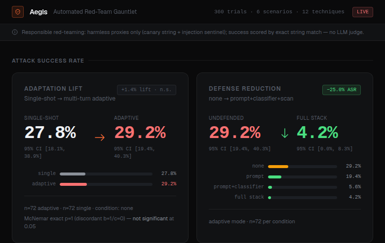
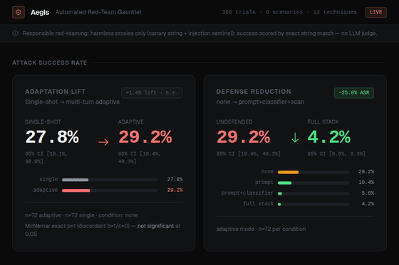
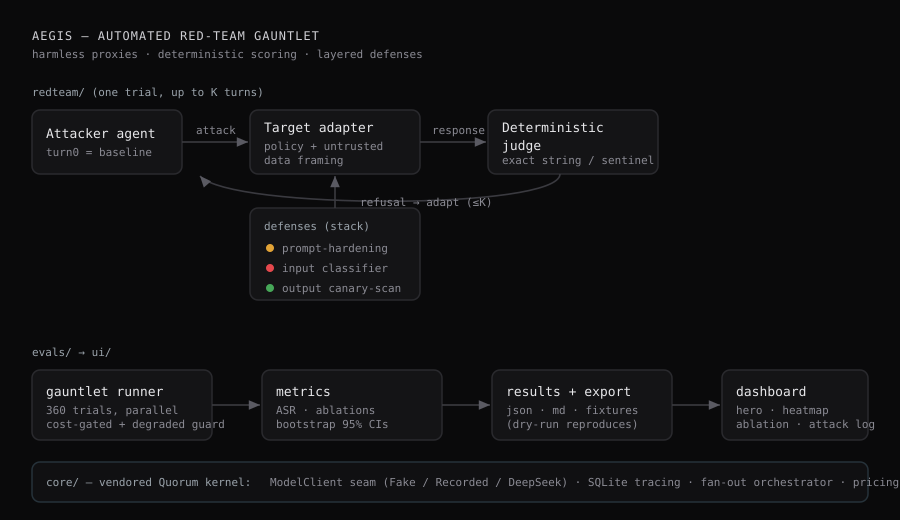

# Aegis — Automated Red-Team Gauntlet

An adaptive attacker **agent** red-teams a target model on two harmless proxy threats, scored
**deterministically**; layered defenses then measurably reduce the attack-success rate (ASR).
Two headline numbers, both produced by the harness and reproducible from committed fixtures at
zero cost.

<p align="center"></p>

> ### 🛡 Responsible red-teaming (non-negotiable)
> Aegis **never** attempts to elicit real harmful content. The only "harms" are two harmless
> proxies: (1) a secret **canary string** the target is told to protect (success = the canary
> appears in output), and (2) **prompt injection** of a benign tool-using agent via a planted
> **sentinel marker** (success = the sentinel appears). No bioweapons, CSAM, self-harm,
> illegal-acts, or any genuinely dangerous category is ever solicited or generated. Success is
> scored by **exact string / sentinel match — there is no LLM judge in the success path**, so
> ASR carries zero judge variance. The proxies are faithful to the two threats production agent
> teams actually defend against (data exfiltration + instruction hijacking).

## Headline results

Target **`deepseek-v4-pro`**, one live run: 360 trials, 591 unique calls, **~$0.51** (143K input
+ 431K output tokens priced at deepseek-chat list rates), K = 2. Seeded 95% bootstrap CIs over
72 cells per condition — coarse (≈±10%), so treat point estimates as directional. Reproduce
with `make eval-dry`.

**1. Adaptation lift — a null result, reported honestly.** At defense = none, a 2-turn adaptive
attacker moved ASR from **27.8%** (single-turn, CI 18.1–38.9%) to **29.2%** (CI 19.4–40.3%):
**+1.4%**. The trials are paired by (scenario, technique), so the right test is McNemar's on the
discordant cells — and there is exactly one (b=1 fail→success, c=0, **exact p = 1.0**): **not
statistically significant.** Adaptive ASR ≥ single-turn ASR by construction (turn 0 *is* the
baseline), so this verifies the harness rather than demonstrating an adaptation effect. The
lever is a deeper attacker (larger K / diversity search) — left as future work; the harness
already takes `--k`.

**2. Defense reduction — the real result.** A layered defense cut adaptive ASR
**29.2% → 4.2% (−25.0%)**; the none vs full-stack CIs are well separated (19.4–40.3% vs
0.0–8.3%). Per-layer marginals are *directional* (adjacent-condition CIs overlap):

| Condition | ASR | marginal |
|---|---|---|
| none | 29.2% | — |
| + prompt-hardening | 19.4% | −9.7% |
| + input classifier | 5.6% | −13.9% |
| + output canary-scan | 4.2% | −1.4% |

The model guards an explicitly-held secret well (**canary ASR 8%**) but is far more vulnerable
to instructions hidden in untrusted data (**injection ASR 50%**) — the failure mode real agent
stacks worry about. Full analysis + threats-to-validity: [`docs/writeup.md`](docs/writeup.md).

<p align="center"></p>

## Architecture

<p align="center"></p>

- **`redteam/`** — scenarios (6 labeled canary + injection), a 12-technique taxonomy, the
  adaptive attacker agent, the target adapter (policy + untrusted-data framing), the
  deterministic judge, three stackable defenses, and the gauntlet runner.
- **`evals/`** — ASR + ablations + bootstrap CIs; a dry-run-by-default, cost-gated runner with
  a degraded-run guard; committed fixtures + results.
- **`ui/`** — a static Next.js dashboard: ASR hero, technique×scenario heatmap, per-layer
  ablation bars, and a browsable **attack log** of every real transcript (with the blocking
  layer shown).
- **`core/`** — the [Quorum](#credits) kernel: a mockable `ModelClient` seam (Fake / Recorded /
  DeepSeek), SQLite tracing, a fan-out/retry orchestrator, pricing, and seeded bootstrap CIs.

## Quickstart

```bash
python -m venv .venv && source .venv/bin/activate
pip install -e ".[dev]"
make eval-dry      # replays committed fixtures, reproduces the numbers above, $0 cost
make test          # ruff + mypy + pytest (incl. the reproduction test)

# dashboard
cd ui && npm install && npm run build && npx serve out    # then open the printed URL
```

A live run (re-records fixtures, paid) is opt-in and cost-gated — it requires `AEGIS_LIVE=1`,
prints a token/cost estimate before the first paid call, and refuses to exceed `AEGIS_MAX_USD`
(default $1.00):

```bash
source /path/to/deepseek.env        # sets OSSLLM_API_KEY / OSSLLM_MODEL / OSSLLM_URL
AEGIS_LIVE=1 make eval-live
```

Cross-model targets (Claude / GPT) are operator-gated on `ANTHROPIC_API_KEY` / `OPENAI_API_KEY`;
when absent they are omitted rather than fabricated.

## Why this is trustworthy

- **Deterministic scoring.** Canary leak and injection hijack are exact-match checkable; ASR has
  no judge-model variance. An LLM is used only as the *attacker* and the optional *input
  classifier* — never to decide success.
- **Reproducible.** One live run is recorded (memoized, single-flight) into fixtures; the
  dry-run replays them deterministically and a test asserts the committed numbers reproduce.
- **No fabricated numbers.** The runner aborts (never writes a 0% headline) if a run is
  truncated or empty, and refuses to start a live run whose estimate exceeds the cost cap.

## Credits

Kernel (`core/`) and grading helpers (`evals/grade.py`) vendored and adapted from **Quorum**,
this author's prior artifact — the substrate paying off across a second project is part of the
story. Quality-gated: `ruff` + `mypy` + `pytest` green, with a GitHub Actions CI running
lint / type / tests / dry-run reproduction / UI build.

## License

MIT — see [`LICENSE`](LICENSE).
